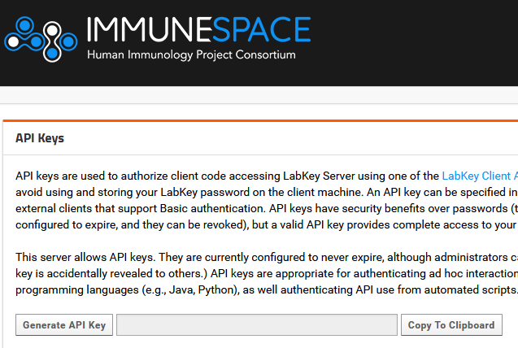

# immunespace-view-api

Python flask API with a wrapper over the labkey API for Immunespace.

The config folder requires a keys.json file containing an API key that can be generated from the Immunespace External Tool Access page. 

LabKey Python API documentation can be found here:
[LabKey Python API](https://www.labkey.org/Documentation/Archive/21.3/wiki-page.view?name=python)
